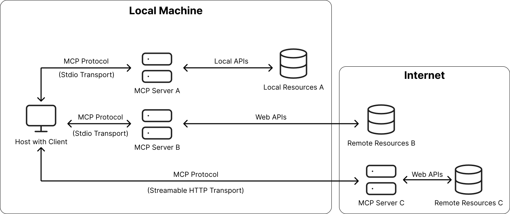
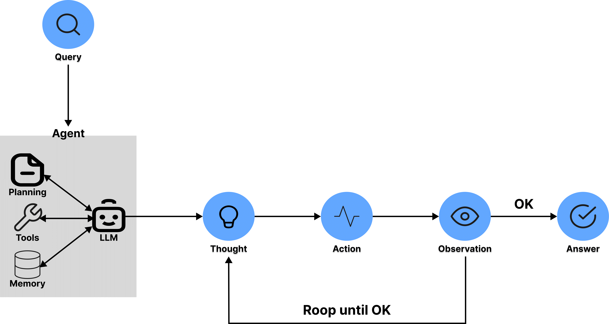
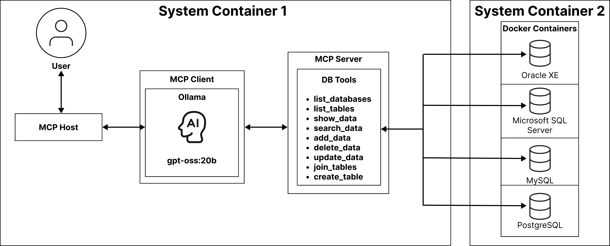

# 온 프레미스(On-Premise) 환경에서의 MCP(Model Context Protocol)를 활용한 범용 Text-to-SQL 에이전트 설계 및 구현에 관한 연구


본 연구는 온프레미스 환경에서 **MCP(Model Context Protocol)**를 활용한 범용 Text-to-SQL 에이전트 시스템입니다. 자연어 질의를 SQL로 변환하여 다양한 데이터베이스와 안전하게 상호작용할 수 있는 시스템입니다.

### 주요 특징
- **온프레미스 환경** - 민감한 데이터를 외부로 전송하지 않아 보안성 확보
- **비용 효율성** - 상용 API 의존성을 제거하여 운영 비용 절감
- **확장성** - MCP 프로토콜 기반으로 총 4개의 데이터베이스 지원
- **지능형 에이전트** - LangGraph 기반 ReAct 프레임워크로 복잡한 질의 처리

## MCP(Model Context Protocol)

2024년 Anthropic에서 제안한 개방형 프로토콜로, LLM과 외부 도구를 표준화된 방식으로 연결합니다.

- **Host-Client-Server 3계층 구조**
- **표준화된 방식으로 확장성과 재사용성 확보**
- **JSON-RPC 기반 통신**



## LLM-based 에이전트

Thought-Action-Observation 순환 구조로 복잡한 질의 단계적으로 해결



## 시스템 아키텍처




## 🛠️ 기술 스택

### 핵심 기술
- **LLM Model**: gpt-oss:20b (OpenAI 오픈소스 모델)
- **Agent Framework**: LangGraph with ReAct 
- **Protocol**: MCP (Model Context Protocol)
- **UI**: Streamlit
- **Container**: Docker

### 상세 스펙
| 구분 | 항목 | 버전/내용 |
|------|------|----------|
| **Hardware** | GPU | NVIDIA V100 32GB |
| **OS** | Operating System | Debian 12.0 Bookworm |
| **Language** | Programming | Python 3.12 |
| **MCP Host** | UI Framework | streamlit==1.44.1 |
| **MCP Client** | LLM Integration | langchain-ollama==0.3.6<br>langgraph==0.3.21 |
| **MCP Server** | Tool Server | mcp[cli]==1.6.0<br>langchain-mcp-adapters==0.0.7 |
| **Container** | Virtualization | Docker 28.3.2 |

## 📦 지원 데이터베이스

- Oracle XE (21c)
- Microsoft SQL Server (2022)
- MySQL (8.0)
- PostgreSQL (15)

## 🚀 설치 방법

### Prerequisites
```bash
# Docker 설치 확인
docker --version

# Python 3.12+ 설치 확인
python --version

# NVIDIA GPU 드라이버 확인 (선택사항)
nvidia-smi
```

### 1. 프로젝트 클론
```bash
git clone https://github.com/[your-username]/mcp-text-to-sql-agent.git
cd mcp-text-to-sql-agent
```

### 2. Docker 컨테이너 빌드
```bash
# 에이전트 컨테이너 빌드
docker build -t mcp-agent ./agent

# 데이터베이스 컨테이너 빌드
docker build -t mcp-database ./database
```

### 3. 환경 설정
```bash
# 환경 변수 설정
cp .env.example .env
# .env 파일을 편집하여 데이터베이스 연결 정보 설정
```

### 4. 시스템 실행
```bash
# Docker Compose로 전체 시스템 실행
docker-compose up -d
```

## 💻 사용 방법

### 웹 인터페이스 접속
```
http://localhost:8501
```

### 자연어 질의 예시

#### 테이블 목록 조회
```
"현재 데이터베이스에 있는 모든 테이블을 보여줘"
```

#### 데이터 조회
```
"employees 테이블에서 급여가 5000 이상인 직원들을 찾아줘"
```

#### 데이터 추가
```
"products 테이블에 새로운 제품을 추가해줘. 이름은 'Laptop', 가격은 1500000"
```

#### 복잡한 질의
```
"각 부서별 평균 급여를 계산하고, 평균 급여가 가장 높은 상위 3개 부서를 보여줘"
```

## 📁 프로젝트 구조

```
mcp-text-to-sql-agent/
├── agent/                    # MCP Client (LangGraph Agent)
│   ├── src/
│   │   ├── agent.py         # 메인 에이전트 로직
│   │   ├── tools.py         # MCP 도구 인터페이스
│   │   └── prompts.py       # LLM 프롬프트 템플릿
│   ├── Dockerfile
│   └── requirements.txt
├── server/                   # MCP Server
│   ├── src/
│   │   ├── server.py        # MCP 서버 구현
│   │   ├── tools/           # 9개의 표준화된 도구
│   │   └── db_connectors/   # 데이터베이스 커넥터
│   ├── Dockerfile
│   └── requirements.txt
├── host/                     # Streamlit UI (MCP Host)
│   ├── app.py               # Streamlit 애플리케이션
│   ├── pages/               # UI 페이지
│   └── requirements.txt
├── database/                 # 데이터베이스 설정
│   ├── init_scripts/        # DB 초기화 스크립트
│   └── docker-compose.yml
├── tests/                    # 테스트 코드
├── docs/                     # 문서
├── .env.example             # 환경 변수 예시
├── docker-compose.yml       # Docker Compose 설정
└── README.md

```

## 🧪 테스트

```bash
# 단위 테스트 실행
pytest tests/unit

# 통합 테스트 실행
pytest tests/integration

# 전체 테스트 실행
pytest
```

## 📊 성능 및 결과

### 실험 결과
- ✅ Oracle XE: 테이블 목록 조회 성공
- ✅ MS SQL Server: 데이터 조회 성공
- ✅ MySQL: 데이터 추가 성공
- ✅ PostgreSQL: 데이터 검색 성공

### 주요 성과
- 4종류의 서로 다른 데이터베이스에서 안정적인 동작 확인
- 자연어를 각 DB 종류에 맞는 SQL 방언으로 자동 변환
- 온프레미스 환경에서 민감한 데이터 보호

## 🔍 MCP Server Tools

개발된 9개의 표준화된 도구:

1. **get_db_info** - 데이터베이스 연결 정보 확인
2. **list_tables** - 테이블 목록 조회
3. **describe_table** - 테이블 스키마 조회
4. **execute_select** - SELECT 쿼리 실행
5. **execute_insert** - INSERT 쿼리 실행
6. **execute_update** - UPDATE 쿼리 실행
7. **execute_delete** - DELETE 쿼리 실행
8. **validate_query** - SQL 쿼리 유효성 검증
9. **format_results** - 결과 포맷팅

## 📝 라이선스

이 프로젝트는 MIT 라이선스 하에 있습니다.

## 👥 저자

- **김지섭** - 동서울대학교 컴퓨터 소프트웨어과
- **김동우** - 동서울대학교 컴퓨터 소프트웨어과
- **이재희** - 동서울대학교 컴퓨터 소프트웨어과 교수

## 🔗 참고 문헌

1. D. Gao, et al., "Text-to-SQL Empowered by Large Language Models: A Benchmark Evaluation," arXiv:2308.15363, 2023
2. S. Yao, et al., "ReAct: Synergizing Reasoning and Acting in Language Models," arXiv:2210.03629, 2022
3. Xinyi Hou et al., "Model Context Protocol (MCP): Landscape, Security Threats, and Future Research Directions", arXiv:2503.23278, 2024

## 🚧 향후 계획

- [ ] A2A(Agent-to-Agent) 아키텍처 기반 멀티 에이전트 구현으로 병렬 처리 
