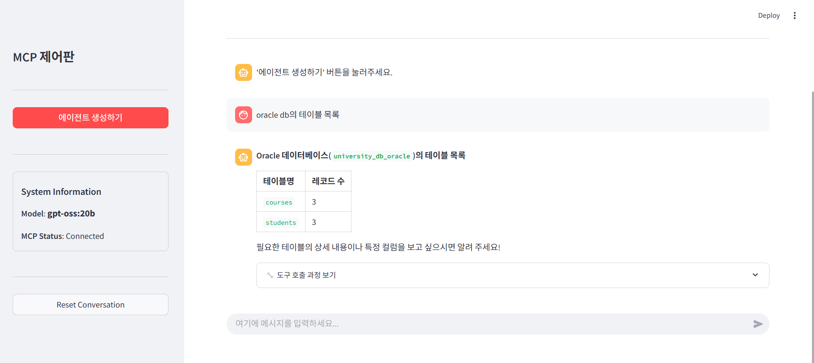
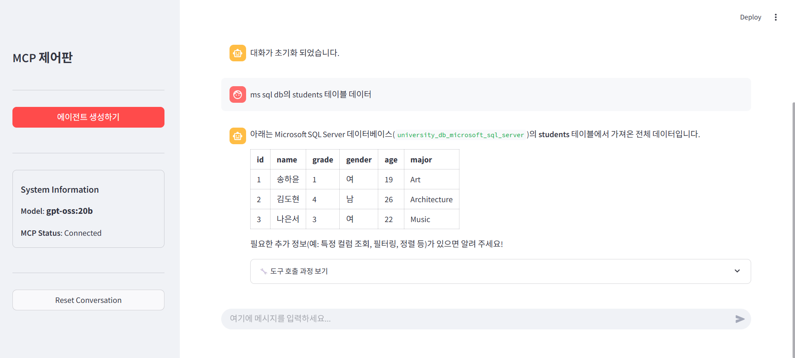
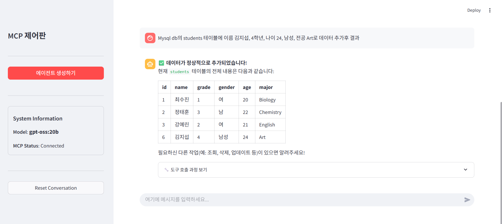
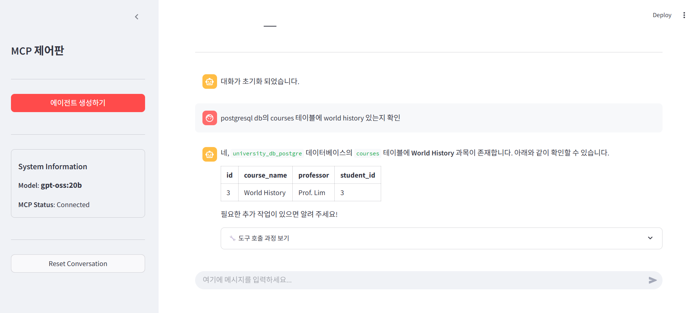

# 온 프레미스(On-Premise) 환경에서의 MCP(Model Context Protocol)를 활용한 범용 Text-to-SQL 에이전트 설계 및 구현에 관한 연구


본 연구는 온프레미스 환경에서 **MCP(Model Context Protocol)**를 활용한 범용 Text-to-SQL 에이전트 시스템입니다. 자연어 질의를 SQL로 변환하여 다양한 데이터베이스와 안전하게 상호작용할 수 있는 시스템입니다.

### 주요 특징
- **온프레미스 환경** - 민감한 데이터를 외부로 전송하지 않아 보안성 확보
- **비용 효율성** - 상용 API 의존성을 제거하여 운영 비용 절감
- **확장성** - MCP 프로토콜 기반으로 총 4개의 데이터베이스 지원
- **지능형 에이전트** - LangGraph 기반 ReAct 프레임워크로 복잡한 질의 처리

## MCP(Model Context Protocol)

2024년 Anthropic에서 제안한 개방형 프로토콜로, LLM과 외부 도구를 표준화된 방식으로 연결합니다.

- **Host-Client-Server 3계층 구조**
- **표준화된 방식으로 확장성과 재사용성 확보**
- **JSON-RPC 기반 통신**


## LLM-based 에이전트

Thought-Action-Observation 순환 구조로 복잡한 질의 단계적으로 해결


## 시스템 아키텍처


## 기술 스택

### 핵심 기술
- **LLM Model**: gpt-oss:20b (OpenAI 오픈소스 모델)
- **Agent Framework**: LangGraph with ReAct 
- **Protocol**: MCP (Model Context Protocol)
- **UI**: Streamlit
- **Container**: Docker

### 상세 스펙
| 구분 | 항목 | 내용 |
|------|------|------|
| **H/W** | GPU | NVIDIA V100 32GB |
| **S/W** | OS | Debian 12.0 Bookworm |
| **S/W** | Language | Python 3.12 |
| **S/W**| LLM | gpt-oss:20b |
| **S/W**  | MCP Host | streamlit==1.44.1 |
| **S/W** | MCP Client | langchain-ollama==0.3.6<br>langgraph==0.3.21 |
| **S/W** | MCP Server | mcp[cli]==1.6.0<br>langchain-mcp-adapters==0.0.7 |
| **S/W** | Database | Oracle XE(21c),<br>Microsoft SQL Server(2022),<br>MySQL(8.0),<br>PostgreSQL(15) |
| **S/W** | Container | Docker 28.3.2 |

## 지원 데이터베이스

- Oracle XE (21c)
- Microsoft SQL Server (2022)
- MySQL (8.0)
- PostgreSQL (15)

## MCP Server Tool 목록

| 이름 | 내용 |
|------|------|
| list_databases | DB 목록 조회 |
| list_tables | 테이블 목록 조회 |
| show_data | 테이블 데이터 조회 |
| search_data | 데이터 검색 |
| add_data | 데이터 삽입 |
| delete_data | 데이터 삭제 |
| update_data | 데이터 변경 |
| create_table | 테이블 생성 |
| join_tables | 두 개의 테이블을 외래 키를 기준으로 결합하여 조회 |

## 프로젝트 구조

```
├── host.py            # MCP Host
├── client.py          # MCP Client
├── mcp_server_db.py   # MCP Server
├── connections.json   # DB 연결 정보
├── mcp_config.json    # MCP Server 목록(연결용)
├── pyproject.toml     # 의존성 목록
```

### 실험 결과

- Oracle XE: 테이블 목록 조회 성공


- MS SQL Server: 데이터 조회 성공


- MySQL: 데이터 삽입 성공


- PostgreSQL: 데이터 검색 성공


이외에도 각각의 DB에 9개의 Tool 사용가능


## 향후 계획

A2A(Agent-to-Agent) 아키텍처 기반 멀티 에이전트 구현으로 병렬 처리

## 라이선스

이 프로젝트는 MIT 라이선스 하에 있습니다.

## 저자

- **김지섭** - 동서울대학교 컴퓨터 소프트웨어과
- **김동우** - 동서울대학교 컴퓨터 소프트웨어과
- **이재희** - 동서울대학교 컴퓨터 소프트웨어과 교수

## 참고 문헌

1. D. Gao, et al., "Text-to-SQL Empowered by Large Language Models: A Benchmark Evaluation," arXiv:2308.15363, 2023
2. S. Yao, et al., "ReAct: Synergizing Reasoning and Acting in Language Models," arXiv:2210.03629, 2022
3. Xinyi Hou et al., "Model Context Protocol (MCP): Landscape, Security Threats, and Future Research Directions", arXiv:2503.23278, 2024

 
